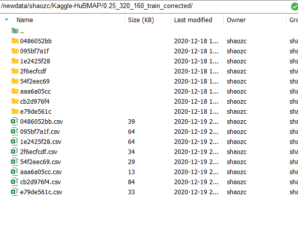
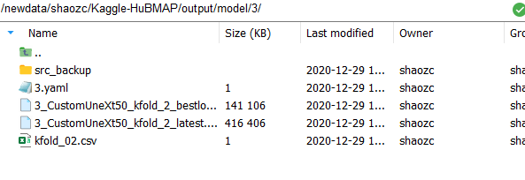
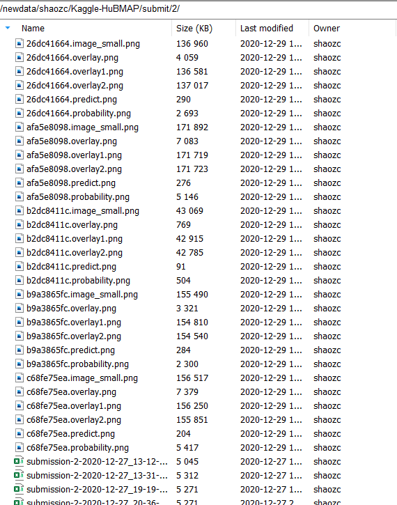

# HuBMAP
代码整体架构按照Pytorch Lightning架构搭建，所需的环境在requirement.txt中

## 1.18补充
### 目前最好的集成方案：
```
#分别训练单个模型
python Src/main.py --config=./Configs/10.yaml
python Src/main.py --config=./Configs/11.yaml
python Src/main.py --config=./Configs/13.yaml
#做集成
python Src/Ensemble_fold.py 
```
- 图片大小采用**512 $\times$ 512**

|模型  | fold0 | fold1 |fold2 |fold3 |
|--|--|--|--|--|
| UneXt50 |0.8948  | 0.9199 | 0.8391 | 0.8851 |

相应模型所在位置：
- UneXt50_fold0 -> `/data/shaozc/Kaggle-HuBMAP/output/model/10/`
- UneXt50_fold1 -> `/data/shaozc/Kaggle-HuBMAP/output/model/11/`
- UneXt50_fold2 -> `/data/shaozc/Kaggle-HuBMAP/output/model/12/`
- UneXt50_fold3 -> `/data/shaozc/Kaggle-HuBMAP/output/model/13/`
- 模型的自集成 ->Src/Ensemble_fold.py

|公开测试集  | fold1 | fold0+fold1+fold2+fold3 |fold0+fold1+fold3 |
|--|--|--|--|
| UneXt50 |0.861  | 0.873 | **0.875** | 

- 不同模型的集成

| 公开测试集 |参数量| fold1 |
|--|--|--|
|  UneXt50| 36M|0.861 |
|  UneXt50_C|143M| 0.864 |
|  CE_Net| 29M|0.855 |
| UneXt50+UneXt50_C+CE_Net | /| 0.863 |

### 目前最好的单个模型方案：
`python Src/main.py --config=./Configs/14.yaml`
- 图片大小采用**320 $\times$ 320**

|模型  | fold0 | fold1 |fold2 |fold3 |
|--|--|--|--|--|
| UneXt50 |0.8946  | 0.9262 | 0.8297 | 0.8784 |
相应模型所在位置：
- UneXt50_fold0 -> `/data/shaozc/Kaggle-HuBMAP/output/model/15/`
- UneXt50_fold1 -> `/data/shaozc/Kaggle-HuBMAP/output/model/14/`
- UneXt50_fold2 -> `/data/shaozc/Kaggle-HuBMAP/output/model/17/`
- UneXt50_fold3 -> `/data/shaozc/Kaggle-HuBMAP/output/model/16/`
- EnResNet34_fold0 -> `/data/shaozc/Kaggle-HuBMAP/output/model/19/`
- EnResNet34_fold1 -> `/data/shaozc/Kaggle-HuBMAP/output/model/18/`
- EnResNet34_fold3 -> `/data/shaozc/Kaggle-HuBMAP/output/model/20/`

- 模型的自集成

|公开测试集  | fold1  |fold0+fold1 |
|--|--|--|
| UneXt50 |**0.871**  |0.870| 


## Tiles的划分
对应的文件夹是`Method3.py`
修改参数位置：
```python
def make_parse():
    parser = argparse.ArgumentParser()
    arg = parser.add_argument
    arg("--tile-scale", type=int, default=0.25)
    arg("--tile-min-score", type=int, default=0.25)
    arg("--tile-size", type=int, default=1024)
    arg("--tile-average-step", type=int, default=512)
    arg("--data-dir", type=str, default='/newdata/shaozc/Kaggle-HuBMAP')
    arg("--train-tile-dir", type=str, default=f'/newdata/shaozc/Kaggle-HuBMAP/0.25_1024_512_train_corrected')
    return parser.parse_args()
```
- 得到的结果示意如图，包括了对于每个大图切割小图组成的文件夹以及包含小图自身的x和y坐标，用于后续将小图的mask进行一个拼接


## Train
`common.py`中选择使用的GPU：
```python
import os
os.environ['CUDA_VISIBLE_DEVICES'] = "1"
```
- `Configs/3.yaml`文件夹下修改参数，或者新建一个`yaml`文件
- 模型的保存根据dice参数进行保存，dice分割的阈值在`Mymetrics`修改：
```python
def np_dice_score(probability, mask):
    p = probability.reshape(-1)
    t = mask.reshape(-1)
    ths = np.arange(0.46,0.54,0.01) #此处想多试几个阈值
    union = torch.zeros(len(ths))
    overlap = torch.zeros(len(ths))
    for i,th in enumerate(ths):
        pt = (p>th)
        tt = (t>th)
        union[i] = pt.sum() + tt.sum()
        overlap[i] = (pt*tt).sum()

    dice = torch.where(union>0, 2*overlap/(union+0.001), torch.zeros_like(union))
    return dice, ths
```
- 得到的结果示意如图
    - src_backup是代码的备份
    - 3.yaml
    - best和last的模型
    - csv文件夹中保存的是训练过程中log的值 


## Test
- `main.py`中修改加载的模型
`model_dir = ['/newdata/shaozc/Kaggle-HuBMAP/output/model/3/3_CustomUneXt50_kfold_2_bestloss.ckpt']`
- `LightningModule`的`test_step`中修改tile切分的大小
```python
tile_size = 512
tile_average_step = 256
tile_scale = 0.25
tile_min_score = 0.25
```
- `LightningModule`的`test_step`中修改生成predict预测图的阈值
```python
predict = (probability>0.5).astype(np.float32)
```
- 在test_step步骤中会生成predict图，结果的示意如下:

- image_small.png是原图缩小32倍后的结果
- overlay.png是对于肾小球预测的概率图
- overlay1.png是加上了原图，同时以实习面积形式在原图上标出位置
- overlay2.png是加上了原图，同时以空心轮廓形式在原图上标出位置
- predict.png是二值化后的图，黑白形式，用以编码形成最后的submission

- 在test_epoch_end步骤中生成submission文件